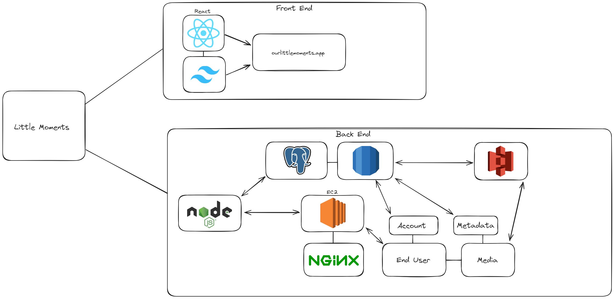

# Little Moments
Little Moments is a full stack application for the purpose of saving every moment. This is a passion project as a way for my family to save photos of our journey in life together. The purpose is to have complete control over the pictures and data, give access to other fmaily members, and for use for IoT devices such as a digital picture frame. 

# Tech stack
- Postgresql
- Nodejs
- Express
- React 
- AWS EC2
- AWS RDS
- AWS S3
- NGINX
- Passport.js

# Application Architecture:

